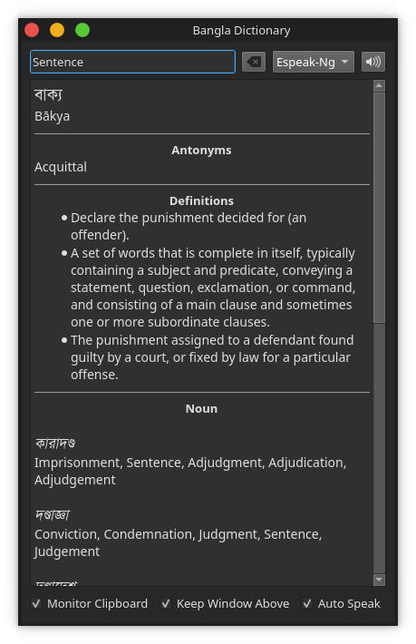

# Bangla Dictionary

A feature-rich dictionary for translating words from English to Bangla and vice-versa.

## Features

1. Word Meaning
1. Synonyms
1. Antonyms
1. Parts of Speech
1. Phonetic Spelling
1. Word Definitions
1. Examples
1. Clipboard Monitoring
1. Stay Above Other Windows
1. Auto Detect Language

## Build and Run

You need `Python v3.5+` and `PyQt5` installed to run this app from source.

- Install `Python v3.5+`
- Install `virtualenv`: `python3 -m pip install virtualenv`
- Create a virtual environment: `virtualenv -p python3 venv`
- Activate `venv`:
    - `source venv/bin/activate` (Linux)
    - `venv\Scripts\activate` (Windows)
- Install requirements: `pip install -r requirements.txt`
- Run `main.py`: `python main.py`

You can also create standalone executable from the source.

- Install `pyinstaller`: `pip install pyinstaller`

### Create Standalone Executable

#### Linux

```sh
pyinstaller -w -i assets/icon.ico -n "Bangla Dictionary" --add-data "assets:assets" -F main.py
```

#### Windows

```sh
pyinstaller -w -i assets/icon.ico -n "Bangla Dictionary" --add-data "assets;assets" -F main.py
```

Now look inside the `dist` directory (created automatically) for the standalone executable.

### Install

N.B. If you build standalone executable in Windows, it is portable, no need to install, just run from anywhere it is.

Linux users can create desktop entry to launch it from launchers.

#### Install System-wide:

```sh
sudo mkdir -p /opt/apps/bangla-dictionary
sudo cp "dist/Bangla Dictionary" /opt/apps/bangla-dictionary/bangla-dictionary
sudo chmod +x /opt/apps/bangla-dictionary/bangla-dictionary
sudo cp assets/icon.png /opt/apps/bangla-dictionary/icon.png
```

#### Create Desktop Entry:

```sh
cat <<EOT | sudo tee /usr/share/applications/bangla-dictionary.desktop
[Desktop Entry]
Version=1.0
Type=Application
Name=Bangla Dictionary
Icon=/opt/apps/bangla-dictionary/icon.png
Exec="/opt/apps/bangla-dictionary/bangla-dictionary"
Comment=Dictionary for English-Bangla-English
Categories=Education;
Terminal=false
EOT
```

## How it Looks



## Precompiled Packages

Find them in [Releases](https://github.com/chitholian/Bangla-Dictionary/releases) page.
